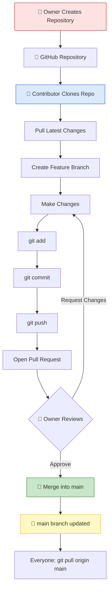
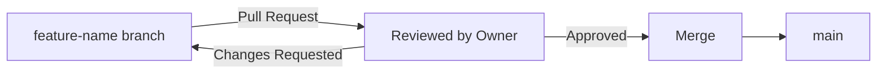
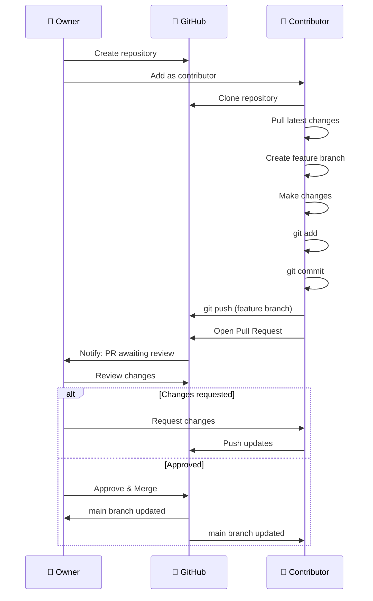

<div align="center">

# GitHub Collaboration Demo 🤝

### A Visual, Character-Themed Seminar Demo Teaching the Owner ↔ Contributor Git Workflow


</div>

---

## 🎯 What Is This?

This is a two-page interactive demo built for a **Git & GitHub seminar** — designed to make the collaboration workflow between a repository **Owner** and a **Contributor** easy to follow, even for a first-time audience.

Instead of a slide full of bullet points, each role gets its own animated, character-themed page:

| Role | Page | Theme |
|---|---|---|
|  **Owner** | `owner.html` | Spider-Man inspired (red & blue) |
|  **Contributor** | `contributor.html` | Doraemon inspired (blue & red) |

The two pages link to each other, so during a live seminar you can flip back and forth as you narrate each side of the workflow.

---

## 🔄 The Workflow at a Glance



---

##  Owner vs  Contributor

|  Owner |  Contributor |
|---|---|
| Creates the repository | Clones the repository |
| Manages the repository & access | Creates a feature branch |
| Adds contributors | Makes code changes |
| Reviews Pull Requests | Commits changes locally |
| Approves or requests changes | Pushes the branch to GitHub |
| Merges approved changes into `main` | Opens a Pull Request |

---

## 🧑‍💻 Git Commands Demonstrated

Each command below maps directly to a step shown on the Contributor page.

| Step | Command | What It Does |
|---|---|---|
| 1️⃣ Clone | `git clone <repository-url>` | 📥 Downloads the repository to your machine |
| 2️⃣ Pull | `git pull origin main` | 🔄 Fetches the latest changes from GitHub |
| 3️⃣ Branch | `git switch -c feature-name` | 🌿 Creates an isolated workspace for your feature |
| 4️⃣ Add | `git add .` | 📦 Stages your changes |
| 5️⃣ Commit | `git commit -m "Add new feature"` | 💾 Saves a snapshot of your changes |
| 6️⃣ Push | `git push origin feature-name` | 📤 Uploads your branch to GitHub |
| 7️⃣ Pull Request | *(via GitHub UI)* | 🔍 Asks the Owner to review before merging |
| 8️⃣ Merge | *(via GitHub UI, after approval)* | 🔀 Combines your changes into `main` |



---

## 📂 Project Structure

```
github-collaboration-demo/
│
├── 📄 owner.html         → Owner's view (Spider-Man theme)
├── 📄 contributor.html   → Contributor's view (Doraemon theme)
└── 📄 README.md          → You are here
```

---

## ▶️ How to Run the Demo

1. Clone or download this repository
2. Open `owner.html` in any browser to start from the Owner's side
3. Click through to `contributor.html` to see the Contributor's workflow
4. Use the two pages side by side (or in two tabs) during your presentation to narrate both sides of a Pull Request live

No build tools, servers, or dependencies required — it's plain HTML + CSS.

---

## 🎬 Suggested Seminar Flow



**Step-by-step narration:**

1. **Owner** creates the repository and adds the contributor
2. **Contributor** clones it, pulls the latest `main`, and creates a feature branch
3. **Contributor** makes changes → `add` → `commit` → `push`
4. **Contributor** opens a Pull Request
5. **Owner** reviews — requests changes or approves
6. **Owner** merges the approved PR into `main`
7. **Everyone** runs `git pull origin main` to sync up 🎉

---

## 🧠 Remember It Easily

| Action | Meaning |
|---|---|
| 📥 **Pull** | Get the latest changes |
| 📤 **Push** | Send your changes up |
| 🔄 **Pull Request** | Ask for a review before merging |
| 🔀 **Merge** | Combine approved changes into `main` |

> **Pull → Work → Commit → Push → Pull Request → Review → Merge**

---

## 🌟 Why This Workflow Matters

GitHub's branch-based collaboration model lets multiple people work on the same project without overwriting each other's work.

- 👥 Enables real team collaboration
- 🌿 Keeps in-progress work isolated on branches
- 🔍 Builds in code review before anything reaches `main`
- 🔄 Gives you full version control and history
- 🛡️ Makes development safer and reversible
- 🚀 Scales from solo projects to large open-source teams

---

## 🎓 Created For

**Topic:** Git & GitHub Collaboration Workflow
**Format:** Live seminar demo
**Concepts covered:** Clone • Pull • Branch • Add • Commit • Push • Pull Request • Review • Merge

---

<div align="center">

###  Build Together. 🤝 Review Together. 🚀 Ship Together.

**GitHub Collaboration Demo**

</div>
